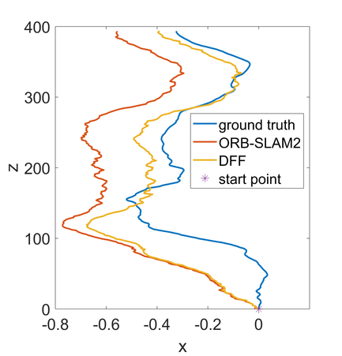
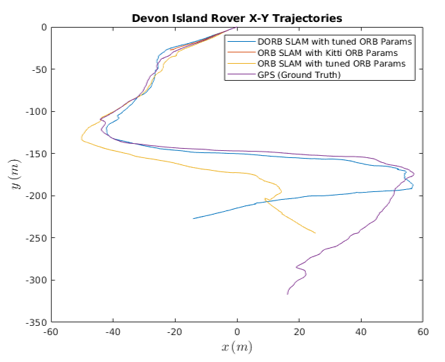
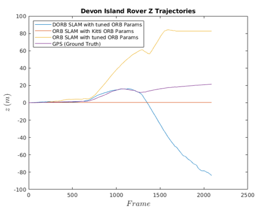

# Dynamic ORB-SLAM

University of Michigan ROB530 WIN19 TEAM6 Project  

## Introduction
**Dynamic ORB-SLAM** is based on [ORB-SLAM2](https://github.com/raulmur/ORB_SLAM2) and tries to make it robust to dynamic and feature-sparse environment. We proposed a **Dynamic Feature Filter (DFF)** to reject dynamic obejcts in the environment and **Dynamic Outlier Thresholding Algorithm (DOTA)** to robustify tracking in feature-sparse environment.

Please refer to our [paper](attachments/NA_568_Final_Report.pdf) for detailed description of our methods for improving ORB-SLAM2.

Result of running ORB-SLAM2 with **DFF** on KITTI sequence 04:


Result of running ORB-SLAM2 with **DOTA** on Devon Island sequence 00:





# Platform

The following installation and examples have been tested on Ubuntu 16.04. 

# Installation

Clone the repository:
```
git clone https://github.com/FeliksBrant/Dynamic_ORB-SLAM
```

Follow [section 2](https://github.com/raulmur/ORB_SLAM2#2-prerequisites) to install all **Prerequistes** for **ORB-SLAM2**. 

We provide a `clean.sh` to remove all pre-built files to have a clean environment for building **ORB-SLAM2**. Execute:
```
cd ORB_SLAM2
chmod +x clean.sh
./clean.sh
```

Then run the script `build.sh` to build **Thirdparty** libraries and **ORB-SLAM2**. Please make sure you have installed all required dependencies (see [section 2](https://github.com/raulmur/ORB_SLAM2#2-prerequisites)). Execute:
```
cd ORB_SLAM2
chmod +x build.sh
./build.sh
```

Note if you are running Ubuntu on Virtual Machine, you might face problems like *virtual memory exhausted: cannot allocate memory* or *internal compiler error: Killed (program cc1plus)*. You might be able to fix them following this [magic solution](https://cryptocurrencytalk.com/topic/14840-how-to-solve-g-internal-compiler-error-killed-program-cc1plus/).

This will create **libORB_SLAM2.so**  at *lib* folder and the executables **mono_tum**, **mono_kitti**, **rgbd_tum**, **stereo_kitti**, **mono_euroc** and **stereo_euroc** in *Examples* folder.

# Examples
After you have succefully built after following previous sections, you can try following examples that demonstrate the main breakthroughs of our project.

For the following examples to run, you need to first unzip the file `ORBvoc.txt.tar.gz` inside folder `ORB_SLAM2/Vocabulary/`.

## Examples for DFF
### Run SLAM
We provide example to test on KITTI sequence 04. To try the example, execute:
```
cd ORB_SLAM2/
./Examples/Stereo/stereo_kitti Vocabulary/ORBvoc.txt Examples/Stereo/KITTI04-12.yaml ../datasets/KITTI/04/
```
After test finishes, a file named `CameraTrajectory.txt` will be created in `ORB_SLAM2` folder. It records the robot trajectory generated from the test.

### Logging
You can also log map points with their estimated velocity. To do so, you need to uncomment *line 570* in `src/Tracking.cc` and *line 1542* in `src/ORBmatcher.cc`. Then you will need to rebuilt by executing
```
cd ORB_SLAM2
./build.sh
```
Then information will be output in the terminal. You can log them to a file by executing
```
cd ORB_SLAM2/
./Examples/Stereo/stereo_kitti Vocabulary/ORBvoc.txt Examples/Stereo/KITTI04-12.yaml ../datasets/KITTI/04/ > %PATH_TO_YOUR_FILE/example_log.csv
```
*log.csv* will record below information in SI units:
- frame number and timestamp
- map point location in world coordinate in current frame, `(xw_,yw_,zw_)`
- map point location in world coordinate in current SLAM map, `(xw,yw,zw)`
- map point speed estimation baesd on current frame and current SLAM map, `e_vel`
- map point speed estimation using DFF, `e_vel_smoothed`

### Analyze Result
To analyze the result, we provide two Matlab scripts. To run them with MATLAB, first 
```
cd analysis/KITTI
```
In this folder, `plot_vel_histogram.m` randomly selects some frames from KITTI 04 sequence and plot the histogram of map points' velocities estimation with and without DFF. `smooth_test_04.m` plots trajectory obtained from ORB-SLAM2 with DFF, original ORB-SLAM2 and ground truth. Their translational and rotational root mean square error are also calculated. 

## Examples for DOTA
### Run SLAM
We provide example to test on Devon Island sequence 00. To try the example, execute:
```
cd ORB_SLAM2/
./Examples/Stereo/stereo_devon Vocabulary/ORBvoc.txt Examples/Stereo/Devon_grey.yaml ../datasets/devon_dataset_grey/sequences/00/
```

After test finishes, a file named `CameraTrajectory.txt` will be created in `ORB_SLAM2` folder. It records the robot trajectory generated from the test.

### Analyze Result
To analyze the result, we provide two Matlab scripts. To run them with MATLAB, first 
```
cd analysis/Devon-Island
```
In this folder, `Plot_Devon_Trajectory.m` will plot specified `CameraTrajectory.txt` files against the GPS ground truth trajectory.

# Acknowledgements
Like so many projects, this effort has roots in many places. Special thanks to Raul Mur-Artal and many on their work on building state-of-art [ORB-SLAM2](https://github.com/raulmur/ORB_SLAM2#2-prerequisites). And thanks of course to our instructor [Maani Ghaffari](https://name.engin.umich.edu/people/maani-ghaffari/) for teaching and providing insights on many topics on SLAM.


